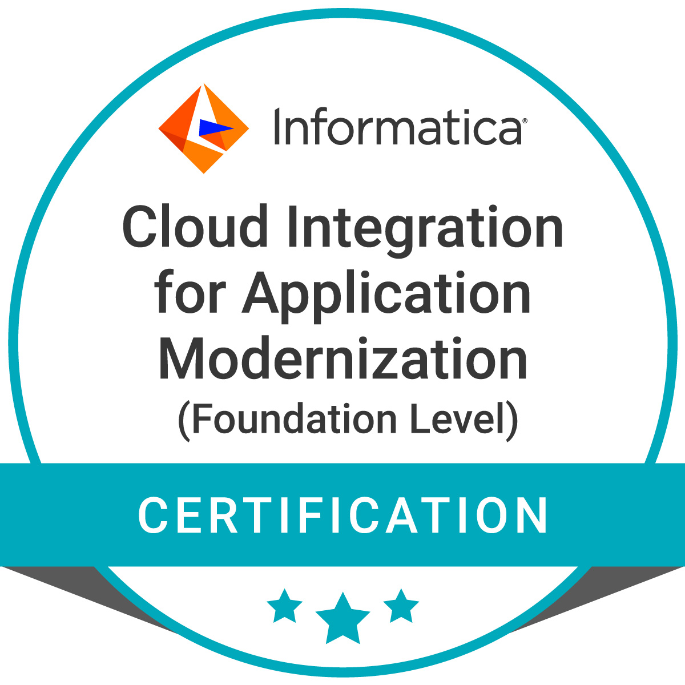

# Cloud Data Warehouse & Data Lake Modernization Foundation Level

This series contains 2 Sessions

Session 1: Market Trends, Architecture, Design Patterns

Session 2: API Integration, Event-Driven Integration, Process Automation

Earned my badge
